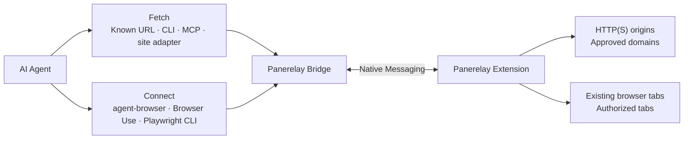

# Panerelay

English ｜ [简体中文](README.zh-CN.md)

[Website](https://f-loat.github.io/panerelay/) · [Chrome Web Store](https://chromewebstore.google.com/detail/panerelay/panplnkjlkoceaonlmpdekjphgmbggmi) · [Documentation](docs/README.md) · [Releases](https://github.com/F-loat/panerelay/releases)

**Browser-authenticated Fetch and existing-browser Connect for AI Agents.**

Panerelay is an open-source local bridge to your existing Chrome or Microsoft Edge. It gives Agents two focused capabilities while cookies and signed-in state stay in the browser:

| Capability | Use it for | Authorization |
| --- | --- | --- |
| **Fetch** | Send HTTP(S) requests with the browser's current login state through CLI, MCP, or site adapters | Approve an exact domain or wildcard domain |
| **Connect** | Attach agent-browser, Browser Use, or Playwright CLI to existing tabs | Authorize the current tab or all supported tabs |

Fetch does not navigate pages or inspect DOM. Connect keeps each automation engine's native commands and page semantics. Panerelay also includes a lightweight side-panel entry for installed local Agents, but Fetch and Connect are the primary integration surfaces.


## Quickstart

Requirements: Chrome or Microsoft Edge on macOS, Linux, or Windows, plus Node.js 20 or newer.

### 1. Install the Extension

Add [Panerelay from the Chrome Web Store](https://chromewebstore.google.com/detail/panerelay/panplnkjlkoceaonlmpdekjphgmbggmi). Microsoft Edge may first ask you to allow extensions from other stores.

### 2. Install Panerelay and the Skill

Run base Setup once, then install the single Panerelay Skill into your Agent:

```bash
npx --yes @panerelay/setup
npx skills add https://github.com/F-loat/panerelay --skill panerelay
```

Setup installs the Native Host and provides the global `panerelay` CLI. The Skill separately teaches the Agent when and how to use Fetch or Connect.

### 3. Ask the Agent for Fetch or Connect

For example:

```text
Use $panerelay to fetch https://example.com/api/me with my browser login state.
Use $panerelay to connect agent-browser to my current Chrome tab.
```

The Skill configures only what the task needs and pauses for browser approval. Fetch approval is domain-based. Connect authorization is tab-based. Focus never grants either permission.

## Fetch with browser login state

Use Fetch when you know the target URL and do not need navigation, DOM, screenshots, or page interaction:

Installed site adapters expose OpenCLI-style commands over the same bounded Fetch path. Install one adapter, or install/update the complete built-in catalog:

```bash
npx --yes @panerelay/setup add bilibili
npx --yes @panerelay/setup add --all
```

Installed adapters use the same authorization boundary and expose shorter site commands such as `panerelay bilibili me`.

The built-in site catalog was migrated from the fetch-compatible parts of [OpenCLI](https://github.com/jackwener/OpenCLI). Thanks to the OpenCLI project and its contributors for the original site implementations.

For a raw request, approve the exact domain and then call an absolute URL. Browser cookies are included by default but never returned; requests stay on the exact origin and redirects fail closed:

```bash
panerelay fetch --authorize api.example.com
panerelay fetch https://api.example.com/me --response json
```

See [browser Fetch compatibility](docs/compatibility/browser-fetch.md), the [site migration catalog](docs/compatibility/opencli-site-migration.md), and the [site adapter guide](packages/sites/README.md).

## Connect automation tools

Use Connect for rendered pages, navigation, interaction, screenshots, downloads, or browser inspection. The unified Skill can set up and verify one of these supported engines:

- [agent-browser](https://agent-browser.dev/)
- [Browser Use CLI](https://docs.browser-use.com/open-source/browser-use-cli)
- [Playwright CLI](https://github.com/microsoft/playwright-cli)

Ask the Agent to use `$panerelay` for the engine you chose. The Skill checks the upstream installation, adds only Panerelay-owned integration files, runs doctor, and pauses when you need to authorize the current tab or all supported tabs. It never installs the upstream automation tool.

After authorization, the Agent verifies that only the selected tabs are visible. Releasing control does not clear the authorization scope. Manual commands and exact compatibility boundaries are available in [Advanced management](#advanced-management) and the [agent-browser](packages/adapters/agent-browser/README.md), [Browser Use](packages/adapters/browser-use/README.md), and [Playwright CLI](packages/adapters/playwright/README.md) integration guides.

## How it works



<details>
<summary>Show technical and security boundaries</summary>

- The Bridge is the local routing and policy boundary.
- Cookies and protected browser state are resolved inside the Extension and are not exported to callers.
- Fetch authorization and tab-control authorization are separate.
- Mutating automation requires a current visible control lease; Fetch never creates one.
- Panerelay does not own or close the browser process, create isolated profiles, or change launch-time proxy settings.

</details>

## FAQ

<details>
<summary>How is Panerelay different from OpenCLI?</summary>

[OpenCLI](https://github.com/jackwener/OpenCLI) is a broader CLI and automation platform with built-in site commands, its own browser primitives, desktop-app adapters, and local-tool routing. Panerelay is a focused local permission and routing boundary for two capabilities: browser-authenticated HTTP Fetch and connecting existing automation engines to explicitly authorized tabs.

Panerelay migrated only OpenCLI adapters that fit its Fetch boundary. DOM extraction, page navigation, interactive OAuth, user-managed API keys, model streaming, and desktop or local-tool automation are not treated as Fetch adapters. When a task needs page interaction, Panerelay Connect keeps agent-browser, Browser Use, or Playwright CLI in charge of the automation semantics.

</details>

<details>
<summary>How is Panerelay different from connecting directly through CDP?</summary>

Panerelay Fetch does not use CDP. Requests run in the Extension background, so they do not depend on an open target tab, navigate or attach to a page, or show Chrome's debugging banner. Compared with making requests through page automation, this removes page and DOM/CDP scheduling overhead: requests are typically faster, and bounded concurrency is more stable.

Panerelay Connect still carries each automation engine's native CDP traffic, but changes the connection and permission boundary. After the user authorizes the current tab or all supported tabs, Agents can create later automation sessions within that scope without a fresh CDP confirmation click for every connection. Panerelay needs no remote-debugging port and uses scoped local credentials and opaque target IDs. The Extension keeps the Agent's current tab-control state visible and lets the user release control at any time. Browser-process ownership and whole-profile operations remain unavailable.

Direct or managed CDP is a better fit when you need isolated browser contexts, launch arguments, proxies, whole-browser ownership, or remote browser infrastructure.

</details>

<details>
<summary>What are Panerelay's main advantages?</summary>

- Fetch reuses browser login state without requiring a target page, showing a debugging banner, or returning Cookie values to the Agent; its direct request path is faster and handles bounded concurrency more reliably than page-driven requests.
- Connect reuses existing tabs without a remote-debugging port or a new CDP confirmation for every automation session; the Agent's current control state stays visible and can be released at any time.
- Separates Fetch domain grants, current-tab or all-supported-tabs Connect authorization, and active page control, with each scope independently visible and revocable.
- Keeps automation-engine choice open: agent-browser, Browser Use, and Playwright CLI retain their normal commands.
- Routes both HTTP requests and engine-native page automation through one local Bridge, stores no model credentials in the Extension, and fails closed when scope or capability is unavailable.

</details>

## Advanced management

<details>
<summary>Show setup, diagnostics, and uninstall commands</summary>

```bash
npx --yes @panerelay/setup
npx --yes @panerelay/setup doctor
panerelay browsers
npx --yes @panerelay/setup uninstall
```

Use `--no-cli` to run setup without installing or updating the global CLI. Uninstall removes only a CLI installed and still owned by Setup; add `--keep-cli` to retain it.

If a global `panerelay` CLI already exists, Setup preserves it. Only a CLI originally installed by Setup is kept in lockstep by later setup or update runs.

Current tested Connect versions are agent-browser 0.33.0 or newer, Browser Use CLI 0.13.7 with Browser Harness 0.1.8, and Playwright CLI 0.1.17 or newer. See each integration guide for exact compatibility boundaries.

Manual Connect integration and verification:

```bash
npx --yes @panerelay/setup --agent-browser
npx --yes @panerelay/setup --browser-use
npx --yes @panerelay/setup --playwright
npx --yes @panerelay/setup doctor --agent-browser --browser-use --playwright

agent-browser --provider panerelay tab list

BU_CDP_URL=http://127.0.0.1:43827/cdp/browser-use browser-use <<'PY'
print(list_tabs())
PY

playwright-cli attach --cdp http://127.0.0.1:43827/cdp/playwright
playwright-cli tab-list
```

The same request path is available as the `panerelay_fetch.browser_fetch` MCP tool. Panerelay-owned Codex and Claude Code sessions receive it automatically. Configure external Agents explicitly when needed:

```bash
npx --yes @panerelay/setup --codex-fetch
npx --yes @panerelay/setup --claude-fetch
npx --yes @panerelay/setup doctor --codex-fetch --claude-fetch
```

To make selected agent-browser or Browser Use integrations the user default, add `--global-default`. For a repository checkout, use `node packages/setup/dist/cli.js --agent-browser --global-default` after building. Playwright remains an explicit attach.

Skill lifecycle remains separate:

```bash
npx skills update panerelay
npx skills remove panerelay
```

</details>

## Development and release checks

<details>
<summary>Show contributor commands</summary>

Workspace development requires Node.js 20.19 or newer and pnpm:

```bash
pnpm install --frozen-lockfile
pnpm run check
```

Build the Extension with `pnpm --filter @panerelay/extension build`, then load `apps/extension/dist` as an unpacked Extension in Chrome or Edge. Do not publish packages or create releases from an unclean worktree.

</details>

## License

[MIT](LICENSE)
