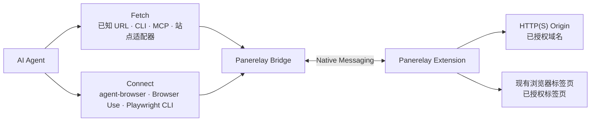

# Panerelay

中文版 ｜ [English](README.md)

[官网](https://f-loat.github.io/panerelay/) · [Chrome 应用商店](https://chromewebstore.google.com/detail/panerelay/panplnkjlkoceaonlmpdekjphgmbggmi) · [文档导航](docs/README.zh-CN.md) · [版本发布](https://github.com/F-loat/panerelay/releases)

**为 AI Agent 提供浏览器登录态 Fetch 和现有浏览器 Connect。**

Panerelay 是连接 AI Agent 与现有 Chrome 或 Microsoft Edge 的开源本地桥梁。它专注提供两项能力，Cookie 和登录状态始终留在浏览器中：

| 能力 | 适用场景 | 授权方式 |
| --- | --- | --- |
| **Fetch** | 通过 CLI、MCP 或站点适配器，携带浏览器登录态发送 HTTP(S) 请求 | 授权精确域名或通配域名 |
| **Connect** | 把 agent-browser、Browser Use 或 Playwright CLI 接入现有标签页 | 授权当前标签页或全部受支持网页 |

Fetch 不负责页面导航和 DOM。Connect 保留各自动化引擎原有的命令与页面语义。Panerelay 也提供一个轻量的本地 Agent 侧边栏入口，但主要接入方式是 Fetch 和 Connect。


## 快速开始

环境要求：macOS、Linux 或 Windows 上的 Chrome 或 Microsoft Edge，以及 Node.js 20 或更高版本。

### 1. 安装扩展

从 [Chrome 应用商店安装 Panerelay](https://chromewebstore.google.com/detail/panerelay/panplnkjlkoceaonlmpdekjphgmbggmi)。Microsoft Edge 可能会先要求允许来自其他商店的扩展。

### 2. 安装 Panerelay Skill

把唯一的 Panerelay Skill 安装到你使用的 Agent：

```bash
npx skills add F-loat/panerelay --skill panerelay
```

### 3. 让 Agent 使用 Fetch 或 Connect

例如：

```text
使用 $panerelay，携带浏览器登录态请求 https://example.com/api/me。
使用 $panerelay，把 agent-browser 接入我当前的 Chrome 标签页。
```

Skill 只配置任务所需的能力，并在需要浏览器授权时暂停。Fetch 按域名授权，Connect 按标签页授权；页面获得焦点不会自动获得任何权限。

## 使用浏览器登录态 Fetch

已经知道目标 URL，且不需要导航、DOM、截图或页面交互时使用 Fetch：

```bash
panerelay fetch https://api.example.com/me --response json
```

站点适配器在同一条受限 Fetch 路径上提供 OpenCLI 风格命令。可以只安装一个，也可以安装或更新完整的内置站点目录：

```bash
npx --yes @panerelay/setup add bilibili
npx --yes @panerelay/setup add --all
panerelay bilibili me
panerelay bilibili me --json
```

内置站点目录迁移自 [OpenCLI](https://github.com/jackwener/OpenCLI) 中可通过 Fetch 实现的部分。感谢 OpenCLI 项目及其贡献者提供原始站点实现。

请求默认携带浏览器 Cookie，但不会返回 Cookie。每个原始请求只能访问 URL 的精确 Origin，重定向会失败关闭，新域名必须由用户在扩展中直接批准：

```bash
panerelay fetch --authorize api.example.com
panerelay fetch --authorize '*.example.com'
```

更多信息见 [浏览器 Fetch 兼容性](docs/compatibility/browser-fetch.md)、[站点迁移清单](docs/compatibility/opencli-site-migration.md)和[站点适配器指南](packages/sites/README.md)。

## Connect 自动化工具

页面渲染、导航、交互、截图、下载或浏览器检查应使用 Connect。统一 Skill 可以安装并验证以下任一引擎的 Panerelay 接入：

- [agent-browser](https://agent-browser.dev/) 0.33.0 或更高版本
- [Browser Use CLI](https://docs.browser-use.com/open-source/browser-use-cli) 0.13.7 + Browser Harness 0.1.8
- [Playwright CLI](https://github.com/microsoft/playwright-cli) 0.1.17 或更高版本

也可以手动运行 setup：

```bash
npx --yes @panerelay/setup --agent-browser
npx --yes @panerelay/setup --browser-use
npx --yes @panerelay/setup --playwright
npx --yes @panerelay/setup doctor --agent-browser --browser-use --playwright
```

Setup 只管理 Panerelay 自己的集成文件，不会安装上游自动化工具。

在扩展中授权目标当前标签页或全部受支持网页，然后验证所选集成。agent-browser：

```bash
agent-browser --provider panerelay tab list
```

Browser Use：

```bash
BU_CDP_URL=http://127.0.0.1:43827/cdp/browser-use browser-use <<'PY'
print(list_tabs())
PY
```

Playwright CLI：

```bash
playwright-cli attach --cdp http://127.0.0.1:43827/cdp/playwright
playwright-cli tab-list
```

结果必须只包含明确授权的标签页。释放会结束当前控制，但保留已选授权范围。

## 工作方式



- Bridge 是本地路由和策略边界。
- Cookie 和受保护浏览器状态只在扩展内部解析，不会导出给调用方。
- Fetch 域名授权和 Connect 标签页控制授权相互独立。
- 自动化写操作需要当前可见控制租约；Fetch 不会创建控制租约。
- Panerelay 不接管或关闭浏览器进程，也不创建隔离 Profile 或修改启动代理。

## 高级管理

<details>
<summary>显示安装、诊断和卸载命令</summary>

```bash
npx --yes @panerelay/setup
npx --yes @panerelay/setup doctor
npx --yes @panerelay/cli browsers
npx --yes @panerelay/setup uninstall
```

同一路径也通过 `panerelay_fetch.browser_fetch` MCP 工具提供。Panerelay 自己管理的 Codex 和 Claude Code 会话会自动获得该工具；外部 Agent 可按需显式配置：

```bash
npx --yes @panerelay/setup --codex-fetch
npx --yes @panerelay/setup --claude-fetch
npx --yes @panerelay/setup doctor --codex-fetch --claude-fetch
```

如需让已选 agent-browser 或 Browser Use 集成成为用户默认连接，可增加 `--global-default`。使用仓库构建时，在完成 build 后运行 `node packages/setup/dist/cli.js --agent-browser --global-default`。Playwright 始终显式连接。

Skill 生命周期独立管理：

```bash
npx skills update panerelay
npx skills remove panerelay
```

</details>

## 开发与发布检查

Workspace 开发要求 Node.js 20.19 或更高版本，并使用 pnpm：

```bash
pnpm install --frozen-lockfile
pnpm run check
```

使用 `pnpm --filter @panerelay/extension build` 构建扩展，然后在 Chrome 或 Edge 中将 `apps/extension/dist` 加载为未打包扩展。工作区不干净时不要发布 package 或创建 release。

## License

[MIT](LICENSE)
