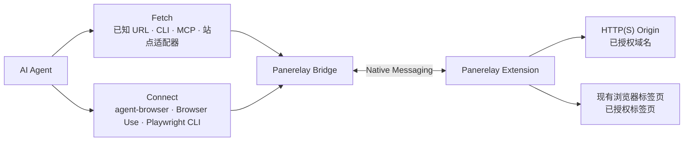

# Panerelay

中文版 ｜ [English](README.md)

[官网](https://f-loat.github.io/panerelay/) · [Chrome 应用商店](https://chromewebstore.google.com/detail/panerelay/panplnkjlkoceaonlmpdekjphgmbggmi) · [文档导航](docs/README.zh-CN.md) · [版本发布](https://github.com/F-loat/panerelay/releases)

**为 AI Agent 提供浏览器登录态 Fetch 和现有浏览器 Connect。**

Panerelay 是连接 AI Agent 与现有 Chrome 或 Microsoft Edge 的开源本地桥梁。它专注提供两项能力，Cookie 和登录状态始终留在浏览器中：

| 能力 | 适用场景 | 授权方式 |
| --- | --- | --- |
| **Fetch** | 通过 CLI、MCP 或站点适配器，携带浏览器登录态发送 HTTP(S) 请求 | 授权精确域名或通配域名 |
| **Connect** | 把 agent-browser、Browser Use 或 Playwright CLI 接入现有标签页 | 授权当前标签页或全部受支持网页 |

Fetch 不负责页面导航和 DOM。Connect 保留各自动化引擎原有的命令与页面语义。Panerelay 也提供一个轻量的本地 Agent 侧边栏入口，但主要接入方式是 Fetch 和 Connect。


## 快速开始

环境要求：macOS、Linux 或 Windows 上的 Chrome 或 Microsoft Edge，以及 Node.js 20 或更高版本。

### 1. 安装扩展

从 [Chrome 应用商店安装 Panerelay](https://chromewebstore.google.com/detail/panerelay/panplnkjlkoceaonlmpdekjphgmbggmi)。Microsoft Edge 可能会先要求允许来自其他商店的扩展。

### 2. 安装 Panerelay 和 Skill

先运行一次基础 Setup，再把唯一的 Panerelay Skill 安装到你使用的 Agent：

```bash
npx --yes @panerelay/setup
npx skills add F-loat/panerelay --skill panerelay
```

Setup 会安装 Native Host 并提供全局 `panerelay` CLI。Skill 则独立负责告诉 Agent 何时、如何使用 Fetch 或 Connect。

### 3. 让 Agent 使用 Fetch 或 Connect

例如：

```text
使用 $panerelay，携带浏览器登录态请求 https://example.com/api/me。
使用 $panerelay，把 agent-browser 接入我当前的 Chrome 标签页。
```

Skill 只配置任务所需的能力，并在需要浏览器授权时暂停。Fetch 按域名授权，Connect 按标签页授权；页面获得焦点不会自动获得任何权限。

## 使用浏览器登录态 Fetch

已经知道目标 URL，且不需要导航、DOM、截图或页面交互时使用 Fetch：

站点适配器在同一条受限 Fetch 路径上提供 OpenCLI 风格命令。可以只安装一个，也可以安装或更新完整的内置站点目录：

```bash
npx --yes @panerelay/setup add bilibili
npx --yes @panerelay/setup add --all
```

已安装的适配器使用相同授权边界，并提供 `panerelay bilibili me` 这样的简短站点命令。

内置站点目录迁移自 [OpenCLI](https://github.com/jackwener/OpenCLI) 中可通过 Fetch 实现的部分。感谢 OpenCLI 项目及其贡献者提供原始站点实现。

直接请求时，先批准精确域名，再请求绝对 URL。请求默认携带浏览器 Cookie，但不会返回 Cookie；每个请求只能访问精确 Origin，重定向会失败关闭：

```bash
panerelay fetch --authorize api.example.com
panerelay fetch https://api.example.com/me --response json
```

更多信息见 [浏览器 Fetch 兼容性](docs/compatibility/browser-fetch.md)、[站点迁移清单](docs/compatibility/opencli-site-migration.md)和[站点适配器指南](packages/sites/README.md)。

## Connect 自动化工具

页面渲染、导航、交互、截图、下载或浏览器检查应使用 Connect。统一 Skill 可以安装并验证以下任一引擎的 Panerelay 接入：

- [agent-browser](https://agent-browser.dev/)
- [Browser Use CLI](https://docs.browser-use.com/open-source/browser-use-cli)
- [Playwright CLI](https://github.com/microsoft/playwright-cli)

让 Agent 使用 `$panerelay` 设置你选择的引擎。Skill 会检查上游安装、只添加 Panerelay 自己的集成文件、运行 doctor，并在需要你授权当前标签页或全部受支持网页时暂停；它不会安装上游自动化工具。

授权后，Agent 会验证只能看到已选标签页。释放控制不会清除授权范围。手动命令与精确兼容边界见[高级管理](#高级管理)，以及 [agent-browser](packages/adapters/agent-browser/README.md)、[Browser Use](packages/adapters/browser-use/README.md)和 [Playwright CLI](packages/adapters/playwright/README.md) 集成指南。

## 工作方式



<details>
<summary>显示技术与安全边界</summary>

- Bridge 是本地路由和策略边界。
- Cookie 和受保护浏览器状态只在扩展内部解析，不会导出给调用方。
- Fetch 域名授权和 Connect 标签页控制授权相互独立。
- 自动化写操作需要当前可见控制租约；Fetch 不会创建控制租约。
- Panerelay 不接管或关闭浏览器进程，也不创建隔离 Profile 或修改启动代理。

</details>

## 常见问题

<details>
<summary>Panerelay 和 OpenCLI 有什么区别？</summary>

[OpenCLI](https://github.com/jackwener/OpenCLI) 是覆盖面更广的 CLI 与自动化平台，包含内置站点命令、自有浏览器操作原语、桌面应用适配器和本地工具路由。Panerelay 则专注作为本地权限与路由边界，提供两项能力：携带浏览器登录态的 HTTP Fetch，以及把现有自动化引擎接入用户明确授权的标签页。

Panerelay 只迁移了符合 Fetch 边界的 OpenCLI 适配器。DOM 提取、页面导航、交互式 OAuth、用户自行管理的 API Key、模型流式调用、桌面应用和本地工具自动化都不会被包装成 Fetch 适配器。需要操作页面时，Panerelay Connect 会继续由 agent-browser、Browser Use 或 Playwright CLI 负责自动化语义。

</details>

<details>
<summary>Panerelay 和直接使用 CDP 有什么区别？</summary>

Panerelay Fetch 完全不使用 CDP。请求由扩展后台发出，不依赖目标站点页面保持打开，也不会导航或附加标签页，更不会显示 Chrome 调试横幅。相比通过页面自动化发请求，它省去了页面和 DOM/CDP 调度开销，因此请求通常更快，受限并发也更稳定。

Panerelay Connect 仍然传递各自动化引擎原生的 CDP 流量，但改变了连接和权限边界。用户授权“当前标签页”或“所有受支持标签页”后，Agent 可以在该范围内建立后续自动化会话，无需每次连接都重新点击 CDP 确认弹窗。Panerelay 不需要开启 remote debugging port，并使用有作用域的本地凭证和不透明目标 ID。扩展会持续展示 Agent 当前的标签页控制状态，用户可以随时释放控制；浏览器进程所有权和整个 Profile 范围的操作仍不可用。

如果需要隔离 BrowserContext、浏览器启动参数、代理、完整浏览器所有权或远程浏览器基础设施，直接 CDP 或托管浏览器会更合适。

</details>

<details>
<summary>Panerelay 的主要优势是什么？</summary>

- Fetch 复用浏览器登录态，不要求目标页面保持打开，不显示调试横幅，也不会把 Cookie 值返回给 Agent；直接请求链路更快，并能比页面驱动请求更稳定地处理受限并发。
- Connect 直接复用现有标签页，不需要开启远程调试端口，也不需要为每个自动化会话重新确认 CDP 弹窗；Agent 当前的控制状态始终可见，并可随时释放。
- 将 Fetch 域名授权、Connect 的当前标签页或所有受支持标签页授权，以及当前页面控制相互分离；每一层权限都可独立查看和撤销。
- 不绑定自动化引擎：agent-browser、Browser Use 和 Playwright CLI 保留各自原有命令。
- 通过同一个本地 Bridge 路由 HTTP 请求和自动化引擎原生的页面操作；扩展不保存模型凭证，授权范围或能力不可用时会失败关闭。

</details>

## 高级管理

<details>
<summary>显示安装、诊断和卸载命令</summary>

```bash
npx --yes @panerelay/setup
npx --yes @panerelay/setup doctor
panerelay browsers
npx --yes @panerelay/setup uninstall
```

使用 `--no-cli` 可在 setup 时跳过全局 CLI 的安装或更新。卸载只会移除仍由 Setup 管理的 CLI；如需保留，可添加 `--keep-cli`。

若全局 `panerelay` CLI 已存在，Setup 会保留它；只有最初由 Setup 安装的 CLI，才会在后续 setup/update 时按 lockstep 更新。

当前经过验证的 Connect 版本为 agent-browser 0.33.0 或更高版本、Browser Use CLI 0.13.7 + Browser Harness 0.1.8，以及 Playwright CLI 0.1.17 或更高版本。精确兼容边界见各集成指南。

手动配置并验证 Connect 集成：

```bash
npx --yes @panerelay/setup --agent-browser
npx --yes @panerelay/setup --browser-use
npx --yes @panerelay/setup --playwright
npx --yes @panerelay/setup doctor --agent-browser --browser-use --playwright

agent-browser --provider panerelay tab list

BU_CDP_URL=http://127.0.0.1:43827/cdp/browser-use browser-use <<'PY'
print(list_tabs())
PY

playwright-cli attach --cdp http://127.0.0.1:43827/cdp/playwright
playwright-cli tab-list
```

同一路径也通过 `panerelay_fetch.browser_fetch` MCP 工具提供。Panerelay 自己管理的 Codex 和 Claude Code 会话会自动获得该工具；外部 Agent 可按需显式配置：

```bash
npx --yes @panerelay/setup --codex-fetch
npx --yes @panerelay/setup --claude-fetch
npx --yes @panerelay/setup doctor --codex-fetch --claude-fetch
```

如需让已选 agent-browser 或 Browser Use 集成成为用户默认连接，可增加 `--global-default`。使用仓库构建时，在完成 build 后运行 `node packages/setup/dist/cli.js --agent-browser --global-default`。Playwright 始终显式连接。

Skill 生命周期独立管理：

```bash
npx skills update panerelay
npx skills remove panerelay
```

</details>

## 开发与发布检查

<details>
<summary>显示贡献者命令</summary>

Workspace 开发要求 Node.js 20.19 或更高版本，并使用 pnpm：

```bash
pnpm install --frozen-lockfile
pnpm run check
```

使用 `pnpm --filter @panerelay/extension build` 构建扩展，然后在 Chrome 或 Edge 中将 `apps/extension/dist` 加载为未打包扩展。工作区不干净时不要发布 package 或创建 release。

</details>

## License

[MIT](LICENSE)
